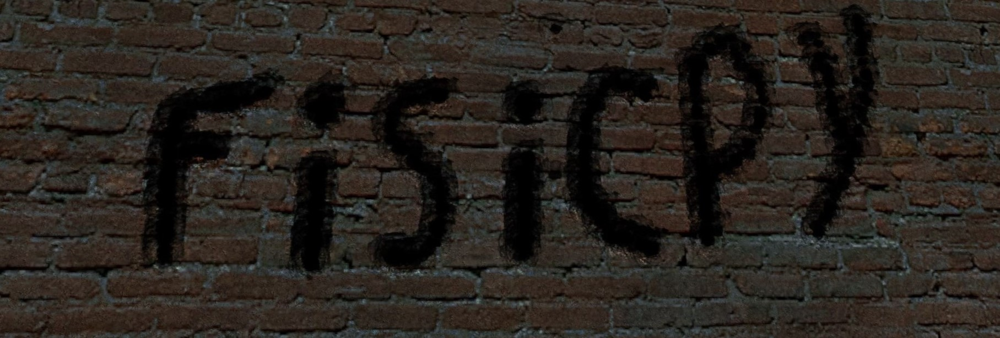

# Savva Ishukov aka fisicpy

### Worked with:
- Python
- C/C++
- HTML + CSS
- Arduino
- etc.

### Projects:
- [Sue](https://github.com/fisicpy/sue)
- [Procedural landscape generation](https://github.com/fisicpy/map_generator)
- [The Sierpinski triangle by the chaos method](https://github.com/fisicpy/chaos-theory)

### Contacts
Site - [https://fisicpy.github.io](https://fisicpy.github.io)

VK - [https://vk.com/fisicpy](https://vk.com/fisicpy)

Instagram - [https://www.instagram.com/fisicpy/](https://www.instagram.com/fisicpy/)
